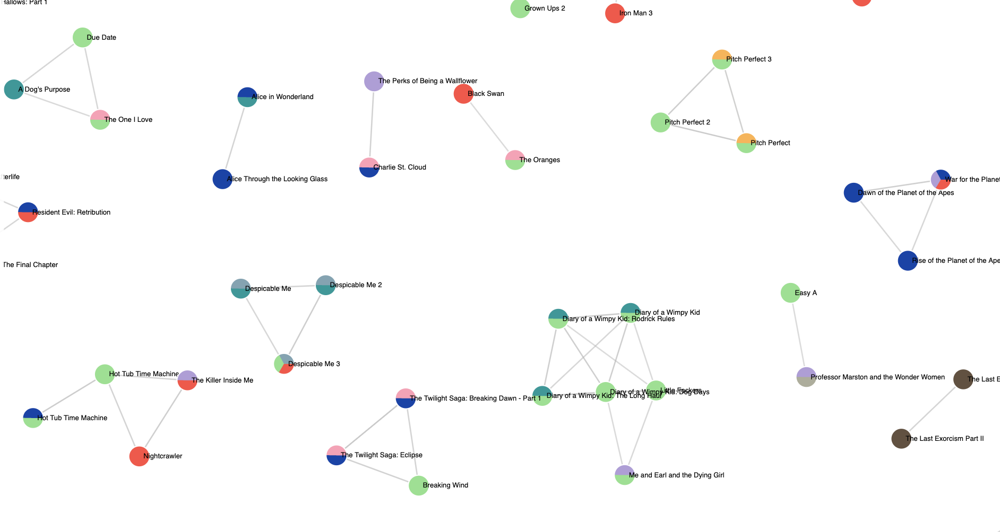

# Project overview
The final result of this project is an interactive force directed graph displaying relationships between various Hollywood movies. Click [here](https://textgraph-app.herokuapp.com/) to view and interact with the graph.

Each circle (node) represents a movie. Similar movies are linked together by lines (edges). The darker the line connecting two movies, the more similar the two movies are to each other. Colours on the node represent movie genre. 

## Data Source
I used [Wikipedia movie plots from Kaggle](https://www.kaggle.com/jrobischon/wikipedia-movie-plots).

## Identify movie similarity 
How do we determine if two movies are similar to each other? 

First, map the movie summary to _vectors_, which are essentially a collection of numbers. To do so, each word in the summary will be mapped to a number. A word will receive a higher score if it is uniquely found in the summary, __and__ has multiple occurences in the summary. For example, the movie _Alice in the Wonderland_ might have a summary like this:

> Alice chases a rabbit down a hole.... Alice encounters many strange things and confronts a mad queen....

The word "Alice" will be mapped to a larger number because we can expect multiple mentions of the word "Alice" (she is the main character after all), and summaries of most other movies will not contain the word "Alice".

In Data Science speak, we have converted our texts to *tf-idf* vectors. Now that we have converted each movie to numbers, we can compute how similar any two movies are to each other. This is done using _cosine similarity_. 

If two movies are represented by the exact same vector (very unlikeley), then the cosine similarity between these two movies is 1. The lowest possible similarity value is 0. 

All movies linked together with an edge (i.e. line) in the network graph have a cosine similarity with its counterpart of at least 0.5.
